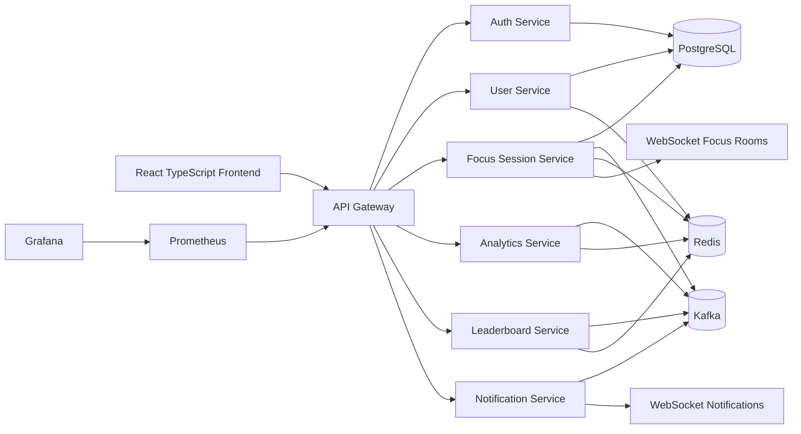

# FocusLoop Platform

FocusLoop is a distributed productivity analytics platform, not a Pomodoro clone. It is designed to demonstrate production backend and full-stack engineering: API gateway routing, JWT auth, OAuth readiness, Redis leaderboards, Kafka event fan-out, WebSocket focus rooms, scheduled analytics jobs, Dockerized infrastructure, and Prometheus/Grafana observability.

## Architecture



## Services

| Service | Port | Responsibility |
| --- | ---: | --- |
| `gateway` | 8080 | Centralized routing, JWT validation, rate limiting, request principal propagation, API boundary logging hooks. |
| `auth-service` | 8081 | Email auth, JWT issuing, refresh token rotation, OAuth2 provider registration for Google, GitHub, and Apple. |
| `user-service` | 8082 | User profile reads and cached identity projection. |
| `focus-session-service` | 8083 | Start/complete focus sessions, integrity scoring, Kafka event publishing, WebSocket focus room presence. |
| `analytics-service` | 8084 | Kafka consumer projections, productivity intelligence, streak and report scheduling, achievement event publishing. |
| `leaderboard-service` | 8085 | Redis Sorted Set rankings for global, country, weekly, monthly, and all-time leaderboards. |
| `notification-service` | 8086 | Achievement notifications and WebSocket delivery. |

## Event Flow

1. A user completes a focus session through `/api/v1/sessions/{id}/complete`.
2. `focus-session-service` calculates quality from idle time, interruptions, and tab switching.
3. It publishes `focus.session.completed.v1` to Kafka.
4. `analytics-service` updates hot Redis projections and emits `achievement.unlocked.v1` when milestones are crossed.
5. `leaderboard-service` increments Redis Sorted Sets for global, weekly, monthly, all-time, and country boards.
6. `notification-service` pushes achievement messages to the user over WebSockets.

## Redis Strategy

| Key | Type | Use | Invalidation |
| --- | --- | --- | --- |
| `leaderboard:global:all-time` | Sorted Set | Durable all-time ranking | Never reset; rebuildable from events/history. |
| `leaderboard:global:weekly:{yyyy-Www}` | Sorted Set | Weekly ranking | Time-windowed key, expires after reporting horizon. |
| `leaderboard:global:monthly:{yyyy-MM}` | Sorted Set | Monthly ranking | Time-windowed key, expires after reporting horizon. |
| `leaderboard:country:{cc}:all-time` | Sorted Set | Country ranking | Rebuildable from event replay. |
| `analytics:user:{userId}:{date}` | Hash | Hot daily analytics projection | Mark dirty on event; persisted by scheduled flush. |
| `user-profile::{userId}` | Cache | Frequently accessed identity profile | Evict on profile update. |

## Database Design

PostgreSQL owns durable records:

- `auth.user_credentials`
- `auth.refresh_tokens`
- `identity.user_profiles`
- `focus.focus_sessions`
- `analytics.daily_focus_metrics`
- `analytics.achievements`

MongoDB is intentionally not used.

## API Design

All public routes are versioned under `/api/v1`.

- `POST /api/v1/auth/register`
- `POST /api/v1/auth/login`
- `POST /api/v1/auth/refresh`
- `GET /api/v1/users/me`
- `POST /api/v1/sessions`
- `POST /api/v1/sessions/{sessionId}/complete`
- `GET /api/v1/analytics/daily?date=YYYY-MM-DD`
- `GET /api/v1/analytics/insights`
- `GET /api/v1/leaderboards?scope=global&period=all-time&limit=50`
- `GET /api/v1/notifications`
- `WS /ws/rooms`
- `WS /ws/notifications`

## Authentication Flow

The gateway is the enforcement point for non-auth routes. It validates JWT access tokens, rejects missing or invalid credentials, and propagates `X-User-Id`, `X-User-Email`, and `X-User-Country` to internal services. Refresh tokens are random opaque values stored as SHA-256 hashes and rotated on refresh. OAuth2 providers are registered in Spring Security for Google, GitHub, and Apple; production deployments should provide client IDs and secrets through environment variables or a secret manager.

## Frontend Architecture

The frontend uses:

- React + TypeScript + Vite
- Tailwind CSS with ShadCN-style local primitives
- Zustand for local focus session state
- TanStack Query for API orchestration
- Framer Motion for subtle dashboard animation
- Recharts for productivity analytics

Feature folders are split by product domain: auth, dashboard, focus, leaderboard, and rooms.

## Local Development

```bash
cd platform
docker compose up --build
```

Useful URLs:

- Frontend: `http://localhost:5173`
- Gateway: `http://localhost:8080`
- Prometheus: `http://localhost:9090`
- Grafana: `http://localhost:3000` with `admin / focusloop`

## Recommended Implementation Order

1. Stabilize shared contracts and API envelopes.
2. Complete auth hardening: OAuth success handlers, cookie transport, refresh token device metadata, logout revocation.
3. Add full persistence projections for analytics and achievements.
4. Add integration tests with Testcontainers for PostgreSQL, Redis, and Kafka.
5. Expand WebSocket room protocol: room membership, timer sync, reconnect recovery, and presence expiration.
6. Add OpenFeign clients only for synchronous reads that are not event-driven, such as profile enrichment.
7. Add Grafana panels for Kafka consumer lag, Redis operations, leaderboard update latency, and active room users.
8. Add image publishing to the CI pipeline once registry credentials are available.
